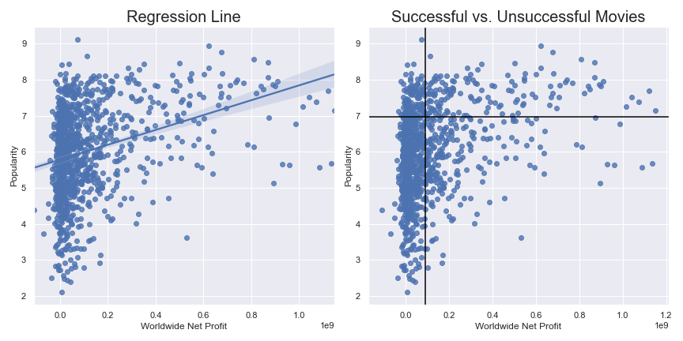
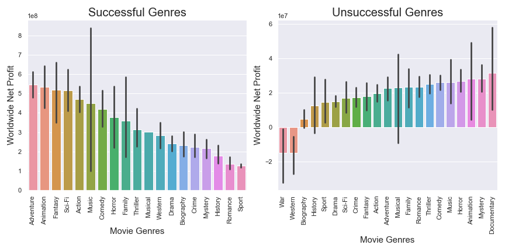
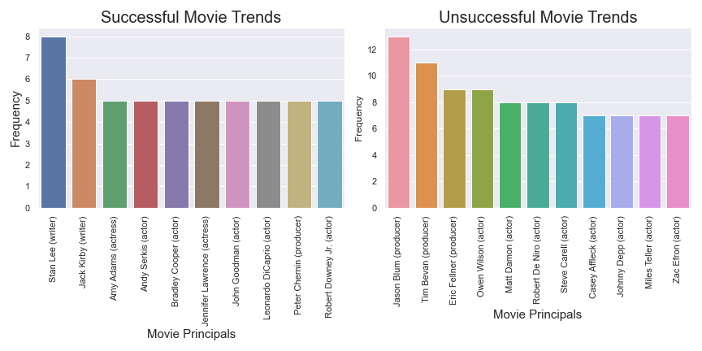

# Microsoft Movie Analysis

**Authors**: Marina Saito

## Overview

Microsoft expressed a desire to create feature films and requested recommendations on the type of movie that would be most profitable and therefore worthwhile for Microsoft to create.  To do this, I looked at data ranking films in terms of popularity and profitability.  I identified the films that were both profitable and popular, and those that were both unprofitable and unpopular.  I then compared the characteristics of the films in each of these categories to identify characteristics that would distinguish the profitable and popular films from the unprofitable and unpopular films.

## Business Problem

There are many elements that can contribute to the success of a movie, both in terms of popularity and profitability, which usually go hand-in-hand.  At the end of the day, however, the film has to be good for it to become a blockbuster and profitable.  But the first step in the process is getting people to watch the film in the first place.  So the threshold question is what will drive people to the theater, and along with that, what is a good investment.

Genre is important because most people who watch films have genre preferences.  Certain genres are for niche audiences, and others are more popular among the consuming public.  So it’s important to distinguish between these in order to advise Microsoft on what is likely to be a profitable blockbuster as opposed to what might be an excellent niche film that is much less profitable.

In addition, certain directors and producers have a reputation that will drive people to watch a film.  In other cases, particular actors and actresses can drive people to watch a film.

All of these factors will be taken into consideration in preparing a recommendation for Microsoft.

## Data

The primary factors I considered to determine a successful movie are revenues and popularity.  Five movie databases provide the data for my analysis:  IMDb, Rotten Tomatoes, The Movie Database (TMDb), the Numbers and Box Office Mojo.
 - Movie Ratings Databases
    - IMDb and Rotten Tomatoes include the most information about the movies (e.g., genres, people associated with the movie such as cast members and production crew, runtime, etc.).  IMDb only includes movies with release dates from 2010, while Rotten Tomatoes reviews movies from as early as 1914.  Since IMDb focuses solely on movies released within the past 10 years, I will use that as the core dataset and add information from the other datasets that match the movies identified in IMDb.
    - Registered users provide movie ratings in IMDb.
    - Rotten Tomatoes includes reviews by critics and audience members.  Audience members are required to provide evidence that they purchased a ticket through Fandango to leave a review.
    - The Movie Database (TMDb) is a community built movie and TV database.  It includes reviews for older movies (released as early as 1930), and has a strong international focus.
 - Revenue Databases
     - The Numbers is a film industry data website that tracks box office revenues.
     - Box Office Mojo also tracks box office revenues.  It was bought by IMDb in 2008.

## Methods

I plot worldwide net profits against the ratings to confirm that the two are related.  Then using the upper quartiles, I divide the data into four quadrants.  The upper right quadrant includes films that are both profitable and popular, while the lower left quadrant includes films that are the least profitable and least popular.  Within these quadrants, I compared not only the genre of the films, but also the primary principals (writers, producers, actors and actresses) involved with the film to identify any trends.



## Results

### Comparing Genres



Based on my analysis, the five most successful movie genres are:
 - Adventure
 - Animation
 - Fantasy
 - Sci-Fi
 - Action

The five least successful movie genres are:
- War
- Western
- Biography
- History
- Sport

I suggest that Microsoft focus on the top five genres, and avoid the bottom five.

### Comparing Principals



The top writers are:
- Stan Lee
- Jack Kirby

The top actors/actresses are:
 - Amy Adams
 - Andy Serkis
 - Bradley Cooper
 - Jennifer Lawrence
 - John Goodman
 - Leonardo DiCaprio
 - Robert Downey Jr
 
The top producer is:
 - Peter Chermin

To the extent that it can afford these writers, producers, and actors/actresses, Microsoft should consider hiring them as they appear to be the most successful, and the data suggests that they would be the safest bets.  Similarly, I would avoid the following individuals who have been less successful:

Producers:
 - Jason Blum
 - Tim Bevan
 - Eric Fellner
 
Actors:
 - Owen Wilson
 - Matt Damon
 - Robert De Niro
 - Steve Carell
 - Casey Affleck
 - Johnny Depp
 - Miles Teller
 - Zac Efron

## Conclusions

I provide the following three recommendations to Microsoft:
 - Focus on the following five movie genres: Adventure, Animation, Fantasy, Sci-Fi and Action.
 - Avoid the following five movie genres: War, Western, Biography, History and Sport.
 - If possible, hire Stan Lee or Jack Kirby to write the movie script, hire Peter Chermin to produce the movie, and include one or more of the following actors/actresses: Amy Adams, Andy Serkis, Bradley Cooper, Jennifer Lawrence, John Goodman, Leonardo DiCaprio, Robert Downey Jr.
 
### Next Steps
 - A number of the films relate to multiple genres.  For example, of the top five films by revenue, three were Action, Adventure and Sci-Fi while the other two were Adventure, Animation and Comedy.  I recommend we further analyze the films based on groups of genres rather than looking at them individually.
 - Similarly, I recommend we further analyze the films based on the different groups of principals that were involved with each film.
 - Finally, if Microsoft has a specific budget in mind, we can analyze all of the films within Microsoft's budget to determine what trends exist within those movies specifically


## For More Information

Please review our full analysis in [our Jupyter Notebook](./dsc-phase1-project-template.ipynb) or our [presentation](./DS_Project_Presentation.pdf).

For any additional questions, please contact **Marina Saito at saito.mn@gmail.com**

## Repository Structure

Describe the structure of your repository and its contents, for example:

```
├── README.md                           <- The top-level README for reviewers of this project
├── Microsoft Detailed Analysis.ipynb   <- Narrative documentation of analysis in Jupyter notebook
├── DS_Project_Presentation.pdf         <- PDF version of project presentation
├── data                                <- Both sourced externally and generated from code
└── images                              <- Both sourced externally and generated from code
```
